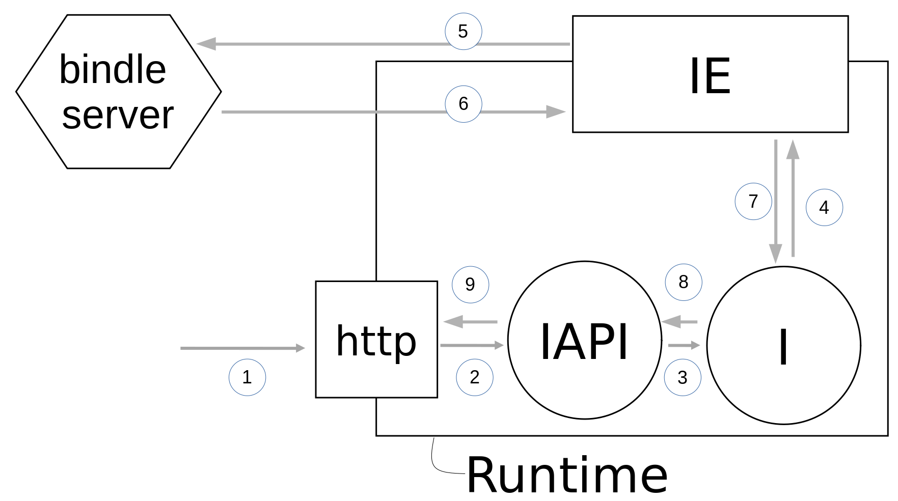
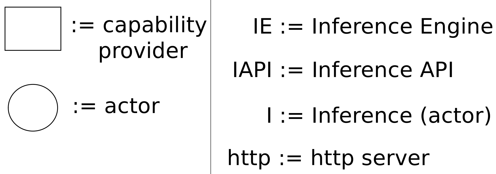

# machine-learning

This repository shall drive the progress towards a support of ML functionality. The following list reflects the conclusions from the *wasmCloud-ml* meeting from 2022-01-11.

## Structure

1. Scope, what to aim for
2. Design decisions
3. Illustration of a corresponding application

## Scope

1. Inference shall be __IN__ scope

> **_[Information]_**  Other actions which are typical for the discipline of machine learning shall deliberately be excluded, e.g. training and data exploration.

## Design decisions

### Inference API actor

The Inference API actor (IAPI) shall

1. be linked to a HTTP server (http)
2. expose a public API for requesting inference actions.
3. validate its input
4. make actor-to-actor calls to an inference actor (I)
5. translate internal results to public HTTP output

### Inference Actor

The Inference Actor (I) shall

6. await actor-to-actor calls to perform actions
7. perform any necessary validation on an incoming call
8. request inference processing from the inference engine (IE) and return results

### Inference Engine Capability Provider

The Inference Engine Capability Provider (IE) shall

9. expose a [WASI-NN](https://github.com/WebAssembly/wasi-nn) *like* style contract to make inference engine requests
10. use a model path to fetch model data from a bindle server
11. interact with some form of inference engine via Rust crate

### Bindle Server

The [bindle server](https://github.com/deislabs/bindle) shall

12. Be deployed "out of the box" as is as a standalone entity for storing/exposing models
13. reference the respective model via a __model path__

## Illustration of a corresponding application

An incoming request (1) at the HTTP server (http) is forwarded to the Inference API actor (IAPI) where the input of the request is validated and routed to the Inference actor (I). The Inference actor (I) triggers an inference processing at the Inference Engine (IE). If the Inference Engine did not yet download the corresponding model, it does so by providing a model path (5) to a bindle server and returning a model (6). The inference result is forwarded (7) to the Inference actor (I) where it is routed (8) back to the Inferenc API actor (IAPI) and finally provided (9) as a response to the request (1) to the HTTP server (http).

The __model path__ can be defined in the [link definition](https://wasmcloud.dev/reference/host-runtime/links/) for the link between the Inference actor (I) and the Inference Engine (IE) such that it is passed to the Inference Engine (IE) when the link is established. Additionally, a __link name__ can be defined in the link definition.

This allows a model to be addressed *upstream*, e.g. in the incoming request (1) of the HTTP server, by a human readable nick name and at the same time it can be referenced *downstream* from the Inference Engine (IE) in the bindle server.